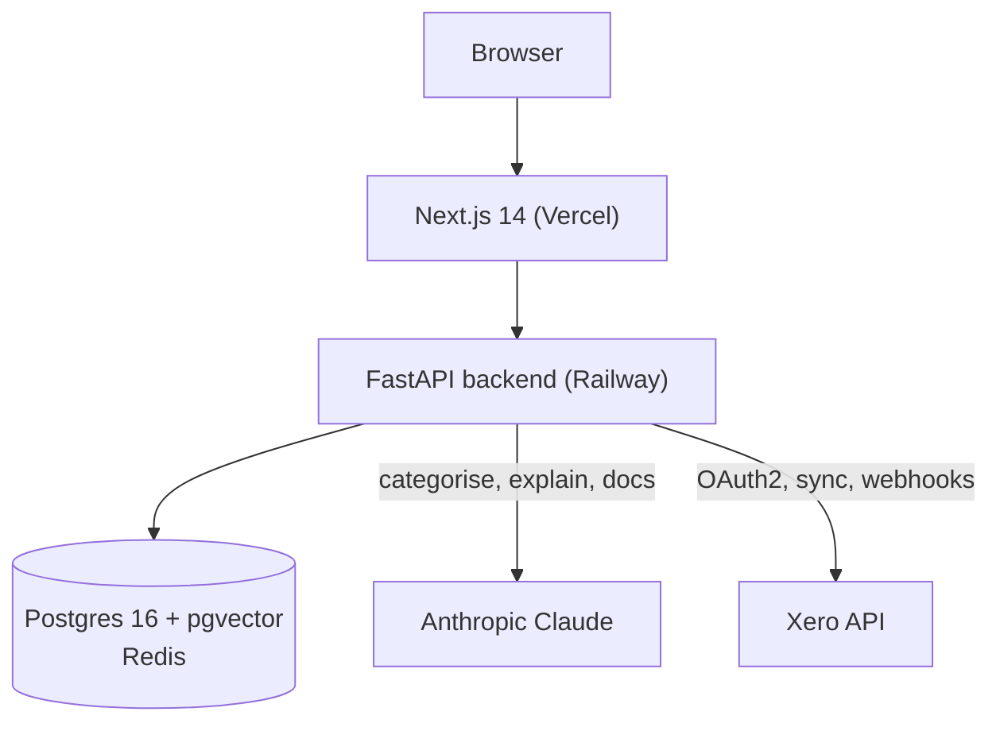
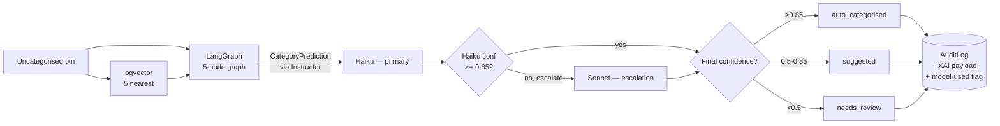

# AI Accountant — AI Engineering Portfolio

A production LLM application demonstrating the full set of patterns that
separate a working demo from a shippable product: structured output,
state-machine agents, RAG with learning-from-corrections, glass-box
explainability, evaluation with acceptance gates, and cost tracking.

**Live app:** [agentic-ai-accounting.vercel.app](https://agentic-ai-accounting.vercel.app)
**Full technical documentation:** [README.md](README.md)
**Source:** ~7,300 lines Python · ~4,600 lines TypeScript · 1,154 lines of tests · 93 passing

---

## What it does

Automates two parts of a UK accountant's workflow:
1. **Categorise** bank transactions against a chart of accounts using an LLM + retrieved few-shot examples from the firm's own correction history.
2. **Reconcile** bank statement lines to transactions using algorithmic scoring with a deterministic, template-generated explanation.

Every decision is stored in an append-only audit log with the full reasoning: the LLM's `reasoning` string, feature importances from an Explainable Boosting Machine, and a fuzzy-logic risk score with the specific rules that fired.

---

## Key results

| Metric | Value | Source |
|---|---|---|
| Categorisation accuracy (overall) | **88%** | 50-transaction UK SME eval fixture |
| Accuracy on easy tier (n=31) | **93.5%** | Unambiguous transactions (HMRC, SaaS) |
| Accuracy at auto-accept threshold (conf > 0.85) | **95%** | Confidence calibration |
| Cost per categorisation (Claude Haiku) | **~$0.0013** | Live token tracking |
| Eval acceptance gates | **3 hard thresholds, enforced** | Runner exits non-zero if missed |
| Tests | **93 passing** | Mocked LLM; runs offline without credentials |

---

## Why this is a non-trivial AI application

### 1. Structured output via Instructor + Pydantic — never free-text parsing

Every LLM call produces typed data, validated by Pydantic, with automatic retry on schema failure. No string splitting, no JSON-mode-hope-for-the-best.

```python
class CategoryPrediction(BaseModel):
    category_code: str
    category_name: str
    confidence: float  # 0.0–1.0
    reasoning: str

# Instructor uses Anthropic tool-use under the hood to force valid output.
prediction = await client.messages.create(
    model="claude-haiku-4-5",
    response_model=CategoryPrediction,
    messages=[...],
)
```

If the model ever returns invalid output, Instructor retries; the caller never sees a malformed response.

### 2. Agents as state machines (LangGraph), not orchestrated prompts

The categoriser is a five-node graph: `fetch_context → classify → validate → decide → explain`. Each node is a pure async function that transforms a typed state dict. The graph is testable node-by-node, inspectable in the audit log, and rolls forward only — no implicit reasoning traces collapsing into a single opaque call.


The same pattern is reused for the reconciliation agent, with the key difference that it contains no LLM at all — neither in the matching decision nor in the explanation. The explanation is produced by a deterministic template over the match scores (see `reconciler.py:174-198`). Deterministic scoring is more trustworthy than an LLM for exact amount / date comparisons, and a fixed explanation template is faster and free at inference time; an LLM rewrite of the explanation is tracked as open work.

### 3. RAG with learning-from-corrections, no retraining required

Transaction descriptions are embedded with `sentence-transformers/all-MiniLM-L6-v2` (384 dims, local, zero API cost) and stored in pgvector. For each new classification, the five most semantically similar **confirmed** transactions from the same firm become few-shot examples in the prompt.

When an accountant corrects a misclassification, the transaction is re-embedded and its new label becomes a training example for the next similar transaction. The vector store acts as the training set; the LLM adapts at inference time via in-context learning. No fine-tuning, no separate training pipeline.

### 4. Glass-box XAI — three layers, all audit-logged

| Layer | Model | When |
|---|---|---|
| LLM reasoning | Claude `reasoning` field via Instructor | Always |
| Feature importances | InterpretML EBM (additive glass-box model) | When ≥50 labelled samples exist; falls back to LLM text below |
| Risk score | Custom Mamdani fuzzy inference (hand-rolled, no library) | Always |

The fuzzy engine is intentionally not `simpful` or `scikit-fuzzy` — implementing triangular membership functions, min-AND rule firing, and centroid defuzzification from scratch keeps the inference logic auditable and modifiable directly. The eight rules are in plain English in `xai/fuzzy_engine.py` and surfaced in the UI when a transaction is flagged.

### 5. Evaluation framework with real acceptance gates

`backend/evals/` is a dedicated eval harness separate from the application test suite. It has:

- 50 labelled fixtures split by difficulty (31 easy, 15 medium, 4 hard)
- Three modes: `mock` (zero API cost, rule-based), `cached` (free reruns), `live` (real API)
- SHA-256 response cache keyed on `(model, prompt)` — all reruns against unchanged fixtures cost $0
- Cost tracker with a `--budget` hard limit that aborts the run before going over
- Acceptance gates enforced at exit code level:
  - Overall ≥ 80%
  - Easy tier ≥ 95%
  - Auto-accept tier (conf > 0.85) ≥ 90%
- Per-category F1/precision/recall
- Confidence calibration report (accuracy by confidence bucket)

```
Overall accuracy: 88.0% (44/50)
By difficulty:
  easy   : 93.5% (29/31)
  medium : 80.0% (12/15)
  hard   : 75.0%  (3/4)
Confidence calibration:
  >0.85  : acc=95.0% (40 txns)  <- auto-accept
  0.5–0.85: acc=71.4% ( 7 txns) <- suggest
  <0.5   : acc=33.3% ( 3 txns)  <- flag
```

### 6. Cost-aware model routing — tiered, not flat

Categorisation runs **Claude Haiku first** (~$0.0013/call). If Haiku's self-reported confidence falls below the 0.85 auto-accept threshold, the same prompt is re-issued to **Claude Sonnet 4.6** (~$0.0047/call) and Sonnet's answer replaces Haiku's. If the Sonnet call errors, Haiku's original prediction is retained — no transaction ever ends up without a result.

The escalation threshold matches the auto-accept threshold by design: below it, the prediction is going to a human anyway, so the extra Sonnet spend either (a) pushes the decision into the auto-accept band and saves a review, or (b) hands the reviewer stronger reasoning. Above it, Haiku is trusted and nothing more is spent. Escalating indiscriminately would multiply total categorisation cost by ~3.75× (the Sonnet/Haiku per-token ratio from `backend/evals/cost_tracker.py`: $3.00/$0.80 for input, $15.00/$4.00 for output), for no measurable gain on the easy tier (where Haiku already hits 93.5% and confidence is typically high).

**Everything else in the cost budget:**

- **Document narrative** runs on Sonnet (~$0.011/doc) — low volume, long coherent output, no pricing pressure.
- **Reconciliation matching** runs on no LLM at all — deterministic RapidFuzz scoring is more trustworthy than an LLM for exact amount/date comparisons.
- Concurrency capped at 5 via `asyncio.Semaphore(5)` so batch jobs don't fan out into 200 parallel API calls.
- Dashboard summary cached in Redis (60s TTL) to avoid redundant DB queries.
- **Pinning policy is deliberately asymmetric**: Haiku pinned to `claude-haiku-4-5-20251001` because it is the eval-critical model where reproducibility matters; Sonnet left on the bare alias `claude-sonnet-4-6` because it runs only in narrative generation and tiered escalation, neither currently in the eval harness — quality patches from Anthropic should flow in automatically there.

Every categorisation audit-logs which model actually produced the final answer, whether escalation fired, the primary model's confidence, and the threshold in effect — so each decision is fully reconstructible after the fact.

At 100 customers processing 20,000 transactions/month, blended AI cost is in the ~£10–£15/month range (0.2–0.3% of revenue at £49/mo pricing), even with escalation enabled.

---

## Production concerns, not just ML concerns

Things an AI engineer ships along with the model:

| Concern | Implementation |
|---|---|
| Observability | Sentry SDK with FastAPI/Starlette/SQLAlchemy integrations; every request tagged with `org_id`; Xero sync failures explicitly captured with context |
| Rate limiting | slowapi with per-organisation keying via JWT `org_id` (not IP — multiple accountants share office IPs); 429 with `Retry-After` header |
| Background jobs | In-process `asyncio.create_task` with Postgres-tracked job state; stale-job sweep on startup marks abandoned jobs as failed; polling endpoint for clients |
| Secrets at rest | Xero OAuth tokens Fernet-encrypted with `enc::` prefix; backwards-compatible with legacy plaintext |
| Real-time sync | Xero webhook receiver with HMAC-SHA256 signature verification; Redis-debounced to prevent sync storms |
| Incremental sync | `If-Modified-Since` header using `last_sync_at` as cutoff; first sync pulls everything, subsequent syncs are near-instant |
| Graceful degradation | Redis unavailable → caching disables silently. Sentry DSN unset → tracking disables. Resend unset → invite emails skipped. App keeps working. |
| Data hygiene | `Decimal` (not float) for all financial amounts; `NUMERIC(12,2)` in Postgres; append-only audit log |
| Compliance | GDPR export (Art. 15/20) and erasure (Art. 17) endpoints with FK-safe deletion order |

---

## Architecture at a glance



**Data flow for one categorisation (with tiered routing):**



---

## Engineering challenges that required judgement

Selected from a longer list in the main README — these are the ones relevant to AI engineering specifically.

**Tiered model routing — cost-aware choice, not a cargo-culted "always use Haiku" or "always use Sonnet".** The naïve setups both fail in specific ways. Running Haiku on everything leaves the hard tier around 75% accuracy, which isn't shippable for accounting work where mistakes have audit consequences. Running Sonnet on everything pays ~3.75× per call (Sonnet/Haiku per-token ratio from `backend/evals/cost_tracker.py`) for negligible gain on the easy tier (where Haiku already scores 93.5% and confidence is typically above 0.85). The implemented design runs Haiku first and only escalates to Sonnet when Haiku's confidence falls below the 0.85 auto-accept threshold — the spend lands exactly where it's most likely to matter. Why that threshold specifically: below it the prediction was going to a human anyway, so Sonnet either promotes the decision into the auto-accept band (saving a review) or gives the reviewer stronger reasoning to evaluate; above it, Haiku is already trusted. The asymmetric pinning policy (Haiku pinned to a dated release, Sonnet on a bare alias) reflects which model is in the eval-critical loop and where reproducibility is worth more than flowing-in quality patches. A live comparison of Haiku-only vs Sonnet-only vs tiered on the 50-fixture eval set is documented and reproducible, and deliberately left pending in the README until budget allows — the baseline Haiku numbers are real, the other rows are marked pending rather than guessed. The production code is already live; the missing piece is the measurement, not the mechanism.

**Structured LLM output was silently failing without Instructor.** The first implementation parsed Claude's response with string splitting. It worked on simple cases but silently returned wrong categories whenever the model added preamble text ("Sure, here is the classification…"). Replaced with `instructor[anthropic]`, which uses Anthropic tool-use to force output conformance to a Pydantic schema, with automatic retry on validation failure. The `CategoryPrediction` model became the enforceable contract between the agent and Claude.

**LangGraph nodes needed database access without polluting graph state.** State dicts must be serialisable (for future checkpoint/resume), so passing an SQLAlchemy session through state would break that invariant. Resolution: `build_categoriser_graph(db)` returns a compiled graph where each node closes over the session via a closure — the session never appears in the state dict.

**Swapped OpenAI for Anthropic midway through the project.** OpenAI's embeddings endpoint is 1536-dim; Anthropic doesn't have one. Decoupled the two concerns entirely: LLM calls use Anthropic via Instructor, embeddings use local `sentence-transformers/all-MiniLM-L6-v2` (384 dims, zero API cost). The pgvector column was resized via an Alembic migration. `asyncio.to_thread()` offloads the CPU-bound embedding work from the async event loop. The two concerns are now swappable independently.

**Vercel deploy silently broke all API calls after a CORS "improvement".** Changed `allow_origins=["*"]` to `allow_origins=[settings.frontend_url]`. In production the Vercel origin didn't match the default, so the browser preflight rejected every `fetch()`. The `TypeError` surfaced to the dashboard as a generic error boundary, and users saw "Xero not connected" — despite OAuth working (server-side redirect, no CORS). Diagnostic: distinguishing a CORS failure (browser-level `TypeError`, no HTTP status visible to app code) from an auth failure (HTTP 401, handled). Fix: reverted to `allow_origins=["*"]` with `allow_credentials=False` — correct for Bearer-token auth that doesn't use cookies.

**Xero's Demo Company bank data was invisible to the API.** `GET /BankTransactions` returned 0 rows for a company with 83 visible transactions in the UI. Root cause: Xero loads demo data into its internal bank-feed layer, which the Accounting API cannot read. Resolution: added a third sync source, `GET /Payments`, which captures payment records against invoices and bills (these bypass the bank-feed layer). Deduplicates against already-synced invoices. Needed a new OAuth scope (`accounting.transactions.read`) and a breaking reconnect for existing users.

---

## Stack (condensed)

**Core:** Python 3.12, FastAPI, SQLAlchemy 2.0 async, Postgres 16 + pgvector, Redis, Alembic, Pydantic v2
**AI:** Anthropic Claude (Haiku + Sonnet), Instructor, LangGraph, sentence-transformers (MiniLM-L6-v2)
**XAI:** InterpretML (EBM), custom Mamdani fuzzy inference, RapidFuzz
**Frontend:** Next.js 14 App Router, TypeScript, Tailwind, shadcn/ui, Framer Motion
**Infrastructure:** Docker, Railway, Vercel, GitHub Actions CI (pgvector service container + WeasyPrint system deps)
**Observability:** Sentry (FastAPI/Starlette/SQLAlchemy integrations)
**Security:** Fernet token encryption, HMAC-SHA256 webhook signatures, per-org rate limiting

---

## What this demonstrates for an AI engineering role

| Capability a job spec asks for | Evidence |
|---|---|
| Production LLM application engineering | LangGraph agents, Instructor structured output, eval gates, response caching, concurrency caps, cost tracking |
| Retrieval-augmented generation | pgvector few-shot lookup, cosine-distance neighbour retrieval, corrections as training examples |
| Evaluation methodology | 50-transaction labelled fixture, difficulty tiers, confidence calibration, cost-per-transaction tracking, CI-enforceable acceptance gates |
| LLM cost optimisation | Tiered model routing (Haiku primary, Sonnet escalate on low confidence), response caching, no-LLM paths where deterministic logic suffices, per-call token tracking, asymmetric model pinning by eval-criticality |
| Explainable / interpretable ML | Glass-box model choices (EBM, fuzzy logic), hand-rolled Mamdani inference, three-layer explanation design |
| Async Python at production scale | Async SQLAlchemy 2.0, asyncpg, background jobs, `asyncio.Semaphore` for concurrency control |
| Third-party API integration | Xero OAuth2 with token refresh + encryption, rate-limit backoff, webhook signature verification, incremental sync |
| Observability and reliability | Sentry integration, structured logging, rate limiting, graceful degradation for every optional dependency |
| Database design | pgvector for embeddings, `Decimal` for money, append-only audit log, Alembic migrations, composite indexes |

---

## Next (open research questions)

These are real unknowns surfaced by the build, not marketing fluff:

1. **Per-organisation confidence calibration.** Fixed thresholds (0.85 / 0.5) were chosen from the generic eval set. Different firms have different transaction distributions — a retail client and a construction firm calibrate differently. Open question: which calibration method (Platt, isotonic, conformal) works best with limited per-firm labelled data?
2. **Explanation utility.** The three-layer explanation UI looks useful. Whether it actually changes accountant decisions vs a single-layer baseline has not been measured.
3. **EBM vs LLM fallback crossover.** The 50-sample threshold for switching from LLM-reasoning fallback to EBM feature importances was chosen conservatively. Empirical crossover point is unknown.
4. **Active learning for review queue prioritisation.** Currently suggests are surfaced in arrival order. Whether selecting reviews that maximally reduce model uncertainty (edge-of-decision-boundary embeddings) reduces human correction count vs passive queue order is an empirical question.

---

## Try it

**Live:** [agentic-ai-accounting.vercel.app](https://agentic-ai-accounting.vercel.app) — requires a Xero account; the demo company works for read-only exploration.

**Locally (offline tests, no API keys needed):**

```bash
git clone https://github.com/rajo69/agentic-ai-accounting
cd agentic-ai-accounting/backend
pip install -e ".[dev,ai,docs]"
pytest -x -v                # 93 tests pass offline
python -m evals.eval_runner --mode mock   # eval framework, no API cost
```

**Full technical documentation:** [README.md](README.md) (architecture, DB schema, API reference, full engineering challenges log, research foundations, GDPR compliance mapping, cost model)
